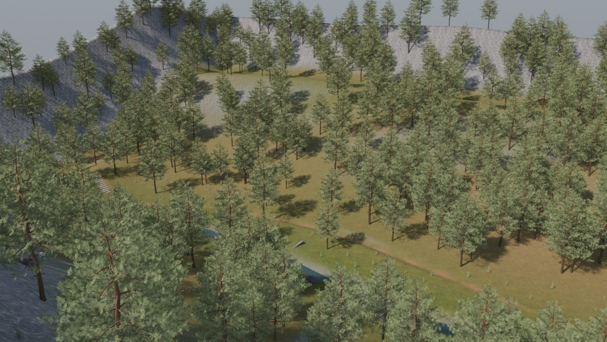
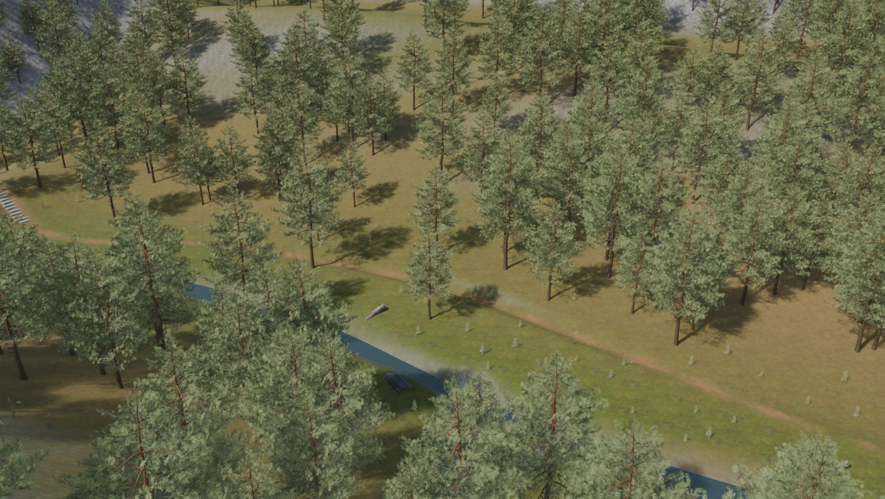
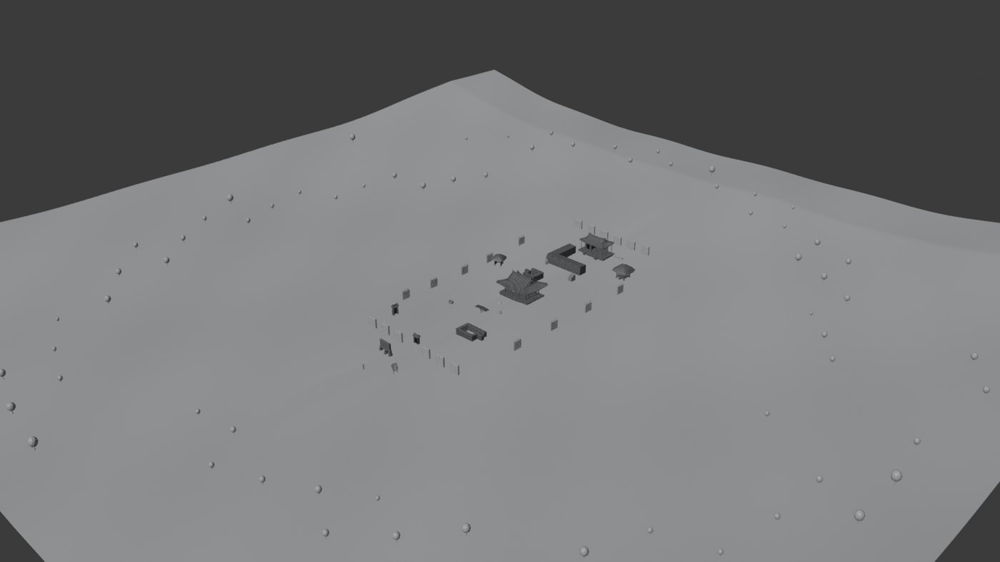

# Heritage Maps

국가유산청(KHS) 공식 3D 스캔과 실측 자료로 지은 한국 배경 게임 맵들.
전부 [ONLY ONE SHOT](https://github.com/ShootTheMoon/onlyoneshot)(OVERDARE)에 넣기 위해 만들었다.

| 맵 | 상태 | 규모 |
|---|---|---|
| **조선 산곡 (JSN_Sangok)** | 게임에 **라이브** | 260 × 260 m, 3,396 인스턴스 |
| **경복궁 (GY)** | 임포트 완료 → 성능 사유로 `ServerStorage` 대기 | 253 인스턴스 (MeshPart 205) |
| **창덕궁 (CDG)** | Blender 단계. 원본 실측·감축 정책 확정 | 원본 25.4 M 트라이앵글 → 목표 1.2 M |
| **소쇄원 (SSW)** | 블록아웃 | — |

---

## 조선 산곡


| | |
|---|---|
|  |  |

**국가유산청 지형 팩에는 "지면"이 없다.** DEM도 하이트맵도 없다는 것이 실측 결론이었다
(243건 135.9 GB를 전수 조사). 실제 구성은 제주 빌레못동굴 90 GB, 무등산 주상절리 모듈 7건,
신두리 식생 6종, 신두리 모래 텍스처, 그리고 **0바이트짜리 다운로드 실패본 15건**이다.

그래서 지형 본체는 **해석적 높이함수로 저작하고**, 스캔은 드레싱으로 얹었다.
스캔만 조립해서는 지형이 나오지 않는다.

- 곰솔 18.3 m / 17,331 tris · 억새·물쑥 0.9–1.3 m / 1.5k–6.0k tris · 주상절리 유닛 9.0–16.2 m / 118k–311k tris
- 전부 `min_z ≈ 0`이라 지면에 그대로 앉는다
- `exports/terrain/` 지형 타일 16장 + `exports/masters/` 식생·암석 마스터 (전부 OVERDARE 변환 완료본)
- 절차서: [`docs/IMPORT_GUIDE.md`](sangok/docs/IMPORT_GUIDE.md) · 배치 스펙: [`docs/PLACEMENT_SPEC.md`](sangok/docs/PLACEMENT_SPEC.md)

## 경복궁


광화문·흥례문·근정문·근정전·회랑·경회루. 좌표 규칙은 확정본이 있다:
**Blender 1 m = OVERDARE 100 cm**, `(x, y, z) → (X, Z, Y)`, 북향 `+Y → −Z`, 궁 스케일 0.6 / 바닥 `Y=5000`.

임포트 과정에서 실제로 겪은 것 — 에셋 지연 로딩 때문에 **bounding 치수가 두 번 적용된 MeshPart 160개**가
생겼고, 남·북 회랑 29개가 누락됐다. 둘 다 복구해 247 직속 자식(MeshPart 205 / Part 41)으로 마감했다.

현재는 월드에 없다. 화성과 함께 `ServerStorage`에 있으며, 화성을 옮긴 것만으로 로비가 28 → 44 fps가 됐다.

## 창덕궁


인정전·구선원전 권역. 원본은 **17개 에셋 25.4 M 트라이앵글 / 508 머티리얼**이고,
에셋들이 서로 정합되어 있지 않아 배치를 OSM 발자국으로 따로 풀어야 했다.
측정값과 함정은 [`docs/SOURCE_FACTS.md`](changdeokgung/docs/SOURCE_FACTS.md)에 전부 정리했다.

원본 스캔(20 GB)과 중간 산물은 이 리포에 포함하지 않는다 — 국가유산청에서 직접 받을 수 있다.

## 소쇄원



담양 소쇄원 블록아웃(무텍스처). 여기서 쓴 임포트 헬퍼(`ssw_live.py`)가 이후 산곡 파이프라인의
바탕이 됐다 — [overdare-map-pipeline](https://github.com/ShootTheMoon/overdare-map-pipeline)에 있다.

---

## 사용법

```bash
git lfs install
git clone https://github.com/ShootTheMoon/heritage-maps.git
```

`exports/`의 FBX는 OVERDARE 규격(30k 트라이앵글, MeshPart당 텍스처 1장, Y-up cm)으로 변환된 상태다.
다른 엔진에 넣을 때는 그 점을 감안할 것.

## 라이선스 / 출처

원본 3D 데이터는 **국가유산청(Korea Heritage Service) 3D 건조물·지형 데이터**이며
**공공누리 제1유형(KOGL Type 1 — 출처표시)**로 개방된 자료다. 이 리포의 파생물도 출처표시를 유지한다.

> 출처: 국가유산청, 국가유산 3D 데이터 (KOGL 제1유형)

문서와 스크립트는 MIT.
